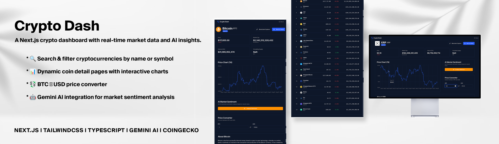

<p align="center">
  
  
  
  
</p>

# Crypto Dash

A modern cryptocurrency dashboard built with **Next.js**, featuring real-time market data, interactive charts, and AI-powered sentiment analysis with **Gemini AI**.

## 🚀 Features

- 🔍 Search & filter cryptocurrencies by name or symbol
- 📊 Dynamic coin detail pages with interactive charts (using React Charts / Chart.js)
- 💱 BTC ⇄ USD price converter
- 🤖 Gemini AI-powered market sentiment analysis

## 🛠 Tech Stack

- Next.js (App Router)
- React Hooks (`useState`, `useEffect`)
- Chart.js / React Charts
- CoinGecko API (crypto market data)
- Gemini AI API (sentiment analysis)
- Tailwind CSS (modern UI styling)

## 📂 Project Structure

```
/app
  /api
    /sentiment        # API route for Gemini AI sentiment analysis
  /coin/[id]          # Dynamic coin detail pages
/components           # UI components (charts, cards, converter)
```

## ⚡ How to Use Gemini AI in This Project

1. Install dependency:

   ```bash
   npm i @google/generative-ai
   ```

2. Create `.env.local`:

   ```env
   GEMINI_API_KEY=your_secret_key_here
   ```

3. Add API route (`app/api/sentiment/route.ts`):

   - Sends news/headlines to Gemini AI.
   - Receives sentiment score, label, and summary as JSON.

4. Use in UI (`SentimentCard.tsx`):
   - Fetch sentiment data from `/api/sentiment`.
   - Display score, progress bar, and summary.

## 🧠 Challenges

- Managing SSR vs CSR with Next.js for API data
- Handling async data fetching with `useEffect` and API routes
- Creating dynamic routes for coin detail pages
- Integrating and visualizing multiple APIs (CoinGecko + Gemini AI)

## 📚 New Skills Learned

- Next.js App Router and dynamic routing
- Efficient API fetching in Next.js
- Data visualization with React Charts
- AI integration (Gemini AI API)
- Better state management with React Hooks

---

Made with ❤️ using Next.js and Gemini AI.
